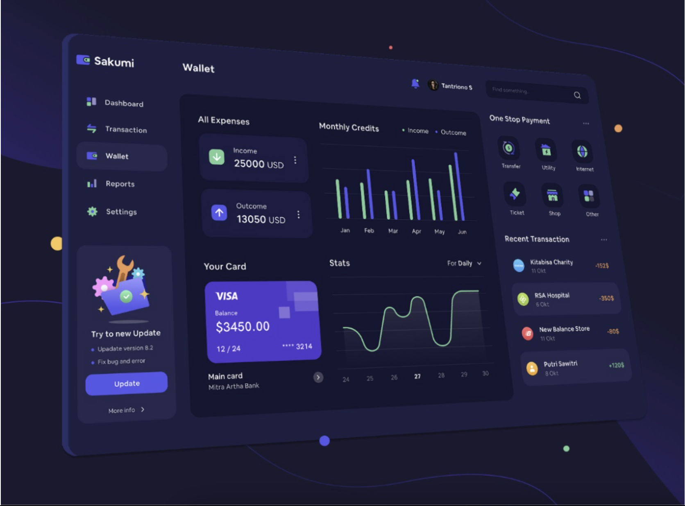
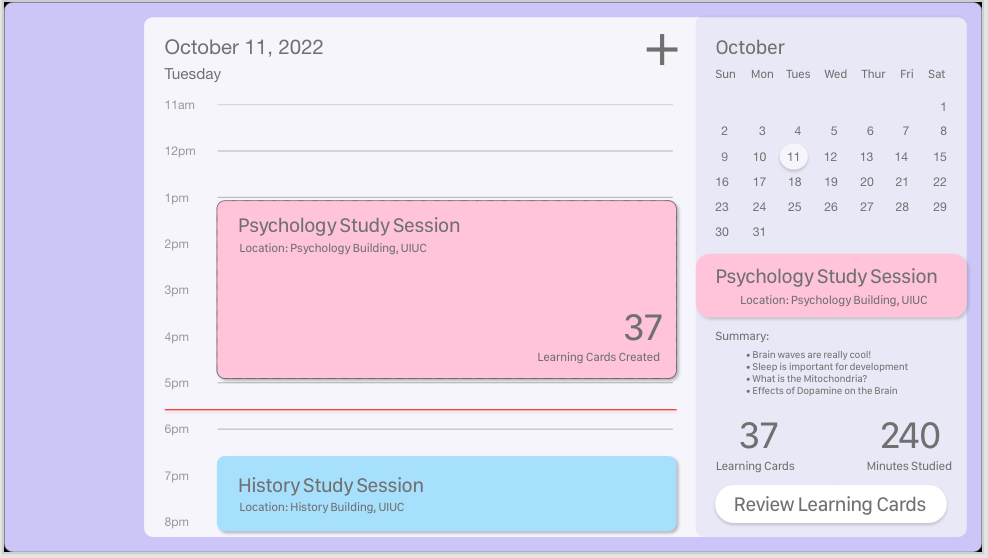
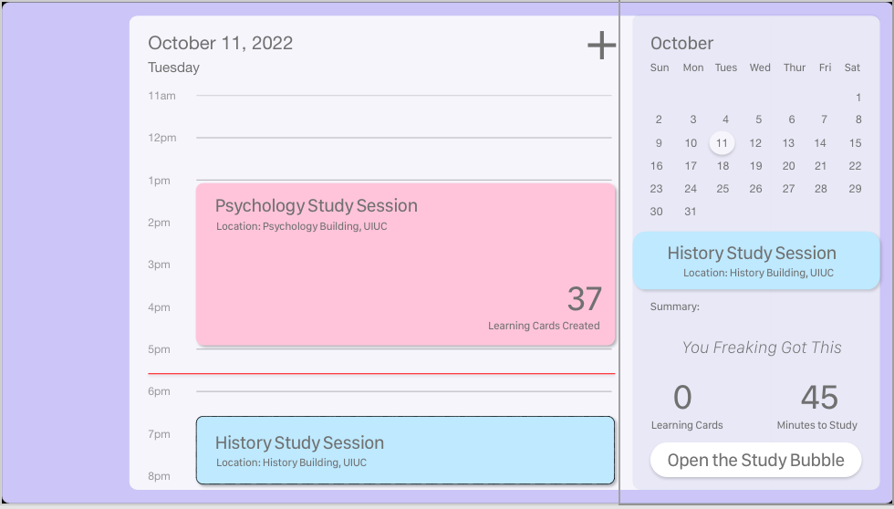
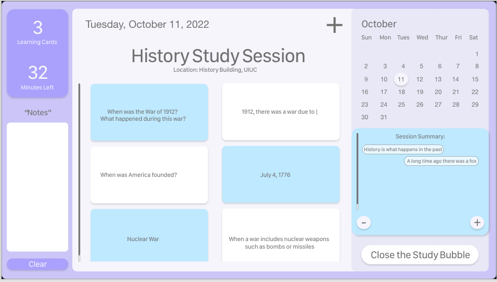

# Study-Bubble-App

## The Initial Idea:

#### March 26th, 2022

When you sit down for a study session, you open a “study bubble”.

You write down where you are, what subject you are going to study, and what’s the end goal (like when are you gonna stop studying).

And then you keep this app open while you are studying and everytime you learn something new you write it down (quizlet kinda format where you make flashcards like “what is the mitochondria” “power house of the cell”).

At the end of the study session you can end it, write down a summary of what you learned basically looking over your flashcards.

It shows on a calendar as like a little study session bubble (for your viewing pleasure and keep track of study times). When you click on the study bubble you can review all the things you learned.

<b>Additional Idea</b>: At the end of the day, you can choose to be quizzed about the material (set a time or manually choose to get tested when it is convient for you). This is great for material that you REALLY need to know

### Why I'm making this app

I think that this app can help people not only organize their study times but also make them more effective - especially for people who have a difficult time with memorization or long term memory. It would be also a great thing to have open that serves as a background of your material, keep you focused on what you are doing because you have this app up that you can come back to, and provide some variation to a study session by taking time to use the app.

### Design

## Completed Items

#### March 29th, 2022

- Adding an api and database to access data for the app
- Added a main layout that will be consisten throughout the app
- Added a working calendar component (code found on medium)
- Styled calendar to fit the design

### Design

I have been designing in AdobeXD for the past few days to create a prototype mockup

Screenshots below:

## Completed Items

#### March 29th, 2022

- Added Hourly View to Main Layout
- Styled Main Layout landing page to fit designs
- Created flashcards
- Create Study Bubble View
- Created Side bar for the Study Bubble View
- Styled Study Bubble View to fit designs
